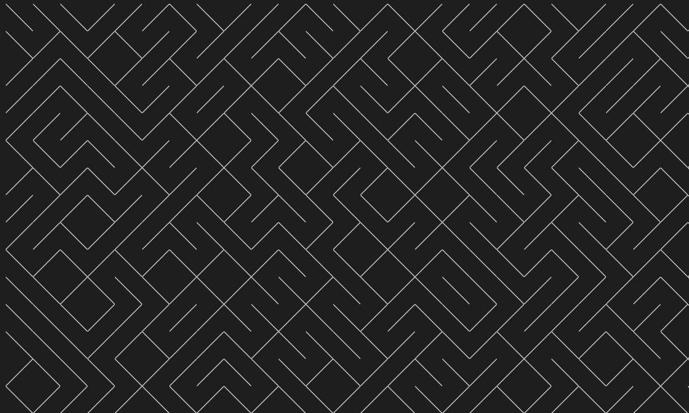

# Maze

Golang maze generator in text mode, inspired by the old BASIC code

```basic
10 PRINT CHR$(205.5+RND(1)); : GOTO 10
```

Best viewed with the [IBM 3270 font maintained by Ricardo Bánffy](https://github.com/rbanffy/3270font)



```console
╲╲╲╱╱╱╲╲╱╱╱╲╲╱╲╱╱╱╱╲╲╱╱╱╲╱╲╲╱╲╲╱╱╲╲╱╱╲╱╲
╲╱╲╱╲╱╱╱╱╱╲╲╱╱╱╲╲╱╲╱╱╱╱╲╲╱╱╱╱╲╲╱╱╲╱╱╲╱╱╲
╱╱╲╲╱╱╲╱╲╱╲╱╱╲╲╱╲╱╱╲╲╱╱╱╲╱╱╲╱╱╲╱╲╲╱╱╲╲╱╱
╱╱╲╲╲╱╱╱╱╲╱╱╲╲╱╲╲╲╱╲╱╱╱╱╱╲╲╱╱╱╲╱╲╱╲╱╱╲╲╲
╱╱╱╲╲╱╲╱╲╲╲╲╲╲╱╲╲╱╲╱╲╲╱╲╱╲╱╱╲╲╱╲╱╱╲╲╲╱╱╱
╲╲╱╲╲╱╱╲╱╱╱╲╱╲╲╲╱╱╱╱╱╲╲╱╲╱╱╱╱╲╲╲╱╱╲╲╱╱╱╱
╱╲╱╲╱╲╱╱╲╲╲╱╱╱╲╱╲╲╲╲╲╲╲╱╲╲╱╲╲╱╱╱╲╱╱╱╱╲╲╲
╱╱╱╲╱╱╱╲╱╱╲╲╲╲╱╲╱╲╲╱╱╲╲╲╱╲╲╱╲╲╱╲╱╲╱╲╲╱╱╱
╱╱╲╱╱╱╲╲╲╱╲╱╱╲╱╱╲╲╱╱╲╲╱╱╱╲╱╲╱╱╱╲╲╲╲╲╱╲╱╲
╲╱╲╱╲╱╲╱╲╱╲╲╲╱╲╱╲╲╲╱╲╲╲╱╲╱╲╲╱╲╲╱╱╱╱╲╱╱╲╲
╲╲╱╲╲╲╱╲╱╲╲╱╲╲╱╲╲╲╲╱╱╱╱╱╲╲╲╱╱╱╱╲╲╲╱╱╲╱╲╲
╲╲╲╱╱╱╱╱╲╲╱╲╲╱╱╲╲╱╱╱╱╱╲╱╱╲╱╲╲╲╲╲╱╱╲╱╱╲╱╲
╲╲╲╱╱╲╱╱╲╱╲╲╲╲╱╱╲╱╲╱╲╱╲╲╲╱╲╱╲╱╱╱╱╲╱╱╱╱╲╱
╱╲╲╲╲╱╱╱╲╲╲╱╲╱╱╲╲╱╱╲╲╲╱╲╱╲╱╱╲╱╱╲╱╱╱╱╱╱╲╱
╲╱╱╱╱╲╲╱╲╱╲╲╱╱╲╲╱╱╲╱╱╲╱╱╲╲╲╲╲╱╲╱╲╲╱╲╲╱╱╱
╲╱╲╱╲╱╲╲╱╲╲╲╱╲╲╲╱╱╲╱╲╱╲╱╲╱╱╱╲╱╱╱╱╲╲╲╲╲╲╲
╲╱╱╱╱╲╲╲╱╱╱╲╱╲╱╱╱╲╲╱╲╱╱╱╲╱╲╲╲╲╲╱╱╲╱╱╱╱╱╱
╲╲╱╲╲╲╱╲╲╲╱╱╲╲╱╱╱╱╲╲╱╱╲╱╲╲╲╲╲╱╲╱╲╱╲╲╱╱╲╱
╲╱╲╲╲╱╲╱╱╲╲╱╱╱╲╱╲╲╲╲╲╱╲╲╱╱╲╱╱╱╱╲╲╱╲╲╲╱╱╲
╲╱╲╲╲╱╲╲╱╲╲╲╲╲╱╱╱╱╱╲╱╱╱╲╱╲╱╱╲╲╱╱╲╱╲╲╲╱╲╱
╱╱╲╱╱╱╲╲╱╲╲╲╱╱╲╲╱╲╲╱╱╱╲╲╱╱╲╲╲╱╲╱╱╲╲╲╱╱╱╲
╲╲╱╲╱╱╱╲╱╱╱╱╱╲╱╱╱╲╲╲╱╲╲╲╱╱╱╲╲╱╲╱╲╲╲╲╲╲╲╲
╱╱╲╱╱╱╲╲╱╲╱╱╲╱╲╲╲╲╲╱╱╱╱╱╲╲╱╲╲╱╲╲╲╲╲╱╱╲╱╱
╲╲╱╱╲╱╱╱╱╲╱╱╱╲╱╱╱╱╱╲╱╲╲╱╲╲╱╱╱╲╲╱╱╲╱╱╱╱╲╲
```

---

[Read more about the maze generator in BASIC](https://10print.org)